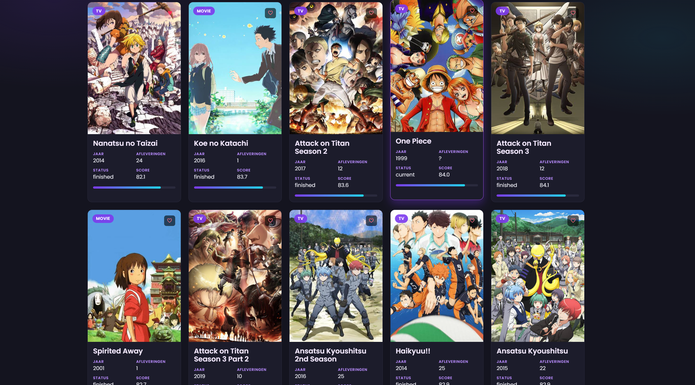
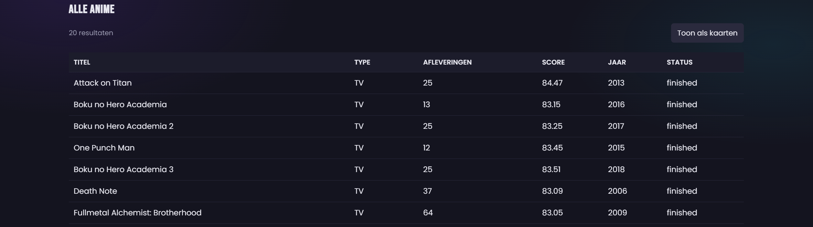
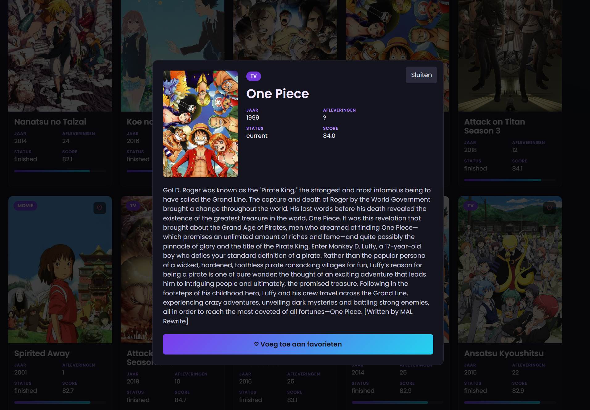
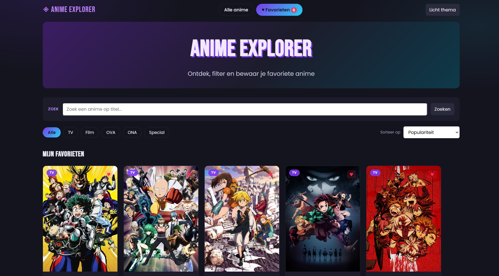
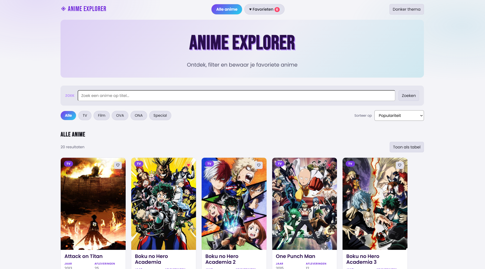
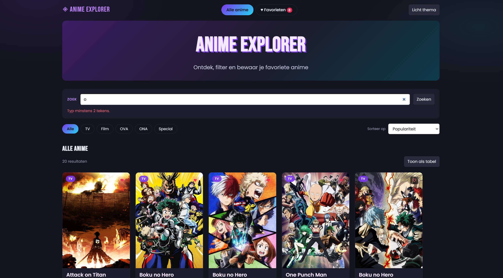
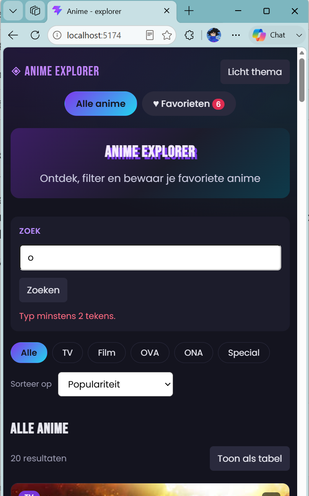

# Anime Explorer

**Auteur:** Nathan Madimba
**Schooljaar:** 2025–2026
**Vak:** Web Advanced (TI1) — Erasmushogeschool Brussel
**Opdracht:** Interactieve Single Page Application (herexamen)

Anime Explorer is een interactieve webapplicatie waarmee je een database van meer dan 22.000
anime kan verkennen. De app haalt live data op bij de Kitsu API en laat je titels doorzoeken,
filteren op type, sorteren op zeven manieren en in detail bekijken in een modal. Anime die je
bevallen bewaar je met één klik in je favorieten — die blijven staan, ook nadat je de browser
sluit.

---

## Inhoudsopgave

1. [Projectbeschrijving & functionaliteiten](#1-projectbeschrijving--functionaliteiten)
2. [Gebruikte APIs](#2-gebruikte-apis)
3. [Screenshots](#3-screenshots)
4. [Installatiehandleiding](#4-installatiehandleiding)
5. [Folderstructuur](#5-folderstructuur)
6. [Technische vereisten — implementatie](#6-technische-vereisten--implementatie)
7. [Technische keuzes en verantwoording](#7-technische-keuzes-en-verantwoording)
8. [Bronvermelding](#8-bronvermelding)

---

## 1. Projectbeschrijving & functionaliteiten

### Wat doet de app?

Bij het openen toont Anime Explorer de twintig populairste anime van dat moment. Van daaruit
kan je verder: zoeken op titel terwijl je typt, filteren op type, en sorteren op populariteit,
score, titel of jaar. Diezelfde lijst bekijk je als kaarten of als tabel, en klikken op een
kaart opent een detailvenster met de volledige samenvatting.

Alles wat je bewaart — je favorieten en je themakeuze — blijft tussen sessies bewaard. De
opgehaalde data wordt een uur lang gecacht, zodat de app bij een herbezoek meteen klaarstaat
zonder het netwerk opnieuw te belasten.

### Dataverzameling & weergave

- Haalt twintig anime op per verzoek uit een database van meer dan 22.000 titels
- **Kaartweergave** met poster, typebadge, titel, jaar, aantal afleveringen, status, score en
  een visuele scorebalk
- **Tabelweergave met zes kolommen:** titel, type, afleveringen, score, jaar en status
- **Detailmodal** met grote poster, alle kerngegevens en de volledige samenvatting
- Wisselen tussen kaarten en tabel gebeurt zonder de data opnieuw op te halen

### Interactiviteit

- **Live zoeken** terwijl je typt, met een vertraging van 200 ms zodat er niet bij elke
  toetsaanslag een verzoek vertrekt
- **Formuliervalidatie** die lege invoer en zoektermen van één teken weigert, met een
  zichtbare foutmelding, nog vóór er iets naar de API gaat
- **Filteren op type** via knoppen: alle, TV, film, OVA, ONA of special
- **Sorteren** op populariteit, score hoog naar laag of omgekeerd, titel A–Z of Z–A, en jaar
  nieuw naar oud of omgekeerd
- **Filteren, sorteren en zoeken werken gecombineerd.** Zoek op "naruto", filter op film,
  sorteer op jaar — het resultaat klopt
- Een teller toont hoeveel resultaten je op dat moment ziet

### Personalisatie

- **Favorieten** toevoegen en verwijderen met het hartje op elke kaart of vanuit de modal
- Aparte **favorietensectie** met een teller in de navigatie
- **Themaswitcher** donker en licht, met de keuze bewaard tussen sessies
- **API-data wordt een uur gecacht** in LocalStorage, per zoekterm apart
- Het volledige anime-object wordt bewaard, niet enkel het id — favorieten zijn daardoor
  meteen zichtbaar zonder extra netwerkverzoek

### Gebruikerservaring

- **Lazy loading** van posters via de IntersectionObserver: afbeeldingen laden pas wanneer ze
  in beeld komen, en worden daarna niet meer gevolgd
- **Laadindicator** tijdens het ophalen van data
- **Lege-statemelding** wanneer een zoekopdracht niets oplevert
- **Foutafhandeling** die de applicatie overeind houdt als de API onbereikbaar is
- Modal sluit met de knop, door ernaast te klikken, of met de Escape-toets
- **Responsive** met media queries op 900 en 600 pixels; de tabel wordt horizontaal
  scrollbaar op smalle schermen
- **Vijf hoveranimaties** op verschillende elementen: kaarten komen omhoog met een paarse
  gloed, knoppen verkleuren, tabelrijen lichten op, hartjes vergroten en filterknoppen
  vullen zich

---

## 2. Gebruikte APIs

| API | Link | Waarvoor |
|---|---|---|
| **Kitsu API** | https://kitsu.docs.apiary.io/ | Alle anime-data: titels, posters, scores, afleveringen, status en samenvattingen |

Er is **geen API-sleutel** nodig. De Kitsu API is gratis en publiek toegankelijk.

### Gebruikte endpoints

| Endpoint | Waarvoor |
|---|---|
| `GET /anime?page[limit]=20&page[offset]=0&sort=-userCount` | De twintig populairste anime |
| `GET /anime?page[limit]=20&page[offset]=0&filter[text]=...` | Zoeken op titel |

### Werken met deze API

Kitsu volgt de **JSON:API-standaard**, wat drie dingen betekent voor de code:

**De velden zitten genest onder `attributes`.** Je schrijft dus `anime.attributes.canonicalTitle`
in plaats van `anime.title`. De lijst zelf haal je uit `data.data`, omdat het antwoord verpakt
zit in een object met `data` en `meta`.

**De paginering telt in items, niet in pagina's.** Pagina twee is `page[offset]=20`, pagina drie
is `page[offset]=40`. Dat is even wennen, maar handiger wanneer je in stappen wil bijladen.

**Maximaal twintig resultaten per verzoek.** Vraag je er meer, dan geeft Kitsu er stilzwijgend
twintig terug.

---

## 3. Screenshots

| Weergave | Screenshot |
|---|---|
| Hoofdpagina — kaartweergave |  |
| Tabelweergave met zes kolommen |  |
| Detailmodal |  |
| Favorieten met teller |  |
| Licht thema |  |
| Validatie van het zoekformulier |  |
| Responsive weergave op mobiel |  |

---

## 4. Installatiehandleiding

### Vereisten

- **Node.js** versie 18 of hoger
- **Git**

### Stappen

```bash
# 1. Repository klonen
git clone https://github.com/Ehbnathanmadimba/Anime---explorer.git
cd Anime---explorer

# 2. Afhankelijkheden installeren
npm install

# 3. Ontwikkelserver starten (opent op http://localhost:5173)
npm run dev

# 4. Productiebuild aanmaken (output in /dist)
npm run build

# 5. De productiebuild lokaal bekijken
npm run preview
```

Er is **geen configuratie of API-sleutel** nodig. Na `npm run dev` werkt de applicatie meteen.

Draait de server op poort 5174 in plaats van 5173, dan is 5173 nog bezet door een andere
instantie. Vite kiest dan automatisch de volgende vrije poort.

---

## 5. Folderstructuur

```
anime-explorer/
├── index.html              # Entry point voor Vite, volledige HTML-structuur (107 regels)
├── package.json            # Projectconfiguratie en scripts
├── vite.config.js          # Vite build-configuratie (22 regels)
├── .gitignore
├── README.md
├── docs/
│   ├── AI-LOG.md           # Log van het AI-gebruik tijdens de ontwikkeling
│   ├── chatlog-ai.md       # Letterlijke chatlog met alle vragen en antwoorden
│   └── screenshots/        # Screenshots voor deze README
├── public/
│   └── favicon.svg
├── src/
│   ├── js/
│   │   ├── main.js         # Entry point: state, event listeners, filteren en sorteren (258)
│   │   ├── ui.js           # DOM-manipulatie: kaarten, tabel, modal, Observer (181)
│   │   ├── api.js          # Netwerklaag: fetch naar Kitsu, cache, foutafhandeling (73)
│   │   ├── storage.js      # LocalStorage: favorieten en voorkeuren (44)
│   │   └── form.js         # Formulierelementen en validatie (25)
│   └── css/
│       └── style.css       # Volledige styling: reset, thema's, layout (694)
└── dist/                   # Wordt aangemaakt door npm run build
```

### Waarom vijf aparte modules?

Elke module heeft één verantwoordelijkheid, en die scheiding is streng doorgevoerd:

- **`api.js`** raakt de DOM niet aan. Hij haalt data op en geeft een array terug, meer niet.
- **`ui.js`** weet hoe iets getoond wordt, maar niet waar de data vandaan komt.
- **`storage.js`** kent alleen LocalStorage en weet niets van anime.
- **`form.js`** valideert invoer zonder te weten wat er daarna mee gebeurt.
- **`main.js`** knoopt alles aan elkaar en beheert de toestand van de applicatie.

Dat is geen theorie gebleven. Toen halverwege het project de eerste API onbruikbaar bleek,
kostte de overstap naar een andere API **alleen aanpassingen in `api.js`** — ongeveer vijftig
regels. Geen enkel ander bestand hoefde aangeraakt te worden, omdat geen enkel ander bestand
de API rechtstreeks kende. Zie [deel 7](#7-technische-keuzes-en-verantwoording).

---

## 6. Technische vereisten — implementatie

Per vereiste staat hieronder **waar** en **hoe** het concept is toegepast, met bestandsnaam en
regelnummer.

### 6.1 DOM manipulatie

| Vereiste | Bestand | Regels | Hoe |
|---|---|---|---|
| Elementen selecteren | `ui.js` | 5–10, 50 | `querySelector` voor de containers, statusmelding, modal en resultatenteller — één keer bij het laden van de module |
| Elementen selecteren | `form.js` | 3–7 | Zoekformulier, invoerveld, foutmelding, filterknoppen en sorteerdropdown |
| Elementen selecteren | `main.js` | 33–41 | Themaknop, weergaveknop, modal, navigatieknoppen en de twee secties |
| Elementen selecteren | `main.js` | 123 | `querySelectorAll('.chip')` om alle filterknoppen tegelijk te doorlopen |
| Elementen manipuleren | `ui.js` | 53, 57 | `textContent` voor de statusmelding en de resultatenteller |
| Elementen manipuleren | `ui.js` | 68, 116, 166 | `innerHTML` gevuld met de opgebouwde kaarten en tabel |
| Elementen manipuleren | `ui.js` | 43, 47 | `classList.remove` en `classList.add` om de modal te tonen en te verbergen |
| Elementen manipuleren | `ui.js` | 128–129 | `src` zetten via `getAttribute` en de class `lazy` verwijderen |
| Elementen manipuleren | `main.js` | 50–53 | `classList.toggle` met tweede parameter om secties en navigatieknoppen te schakelen |
| Elementen manipuleren | `main.js` | 139 | `classList.toggle('licht')` wisselt het thema op `body` |
| Events koppelen | `main.js` | 56–57 | `click` op de navigatieknoppen |
| Events koppelen | `main.js` | 114, 131 | `click` op de filterknoppen, `change` op de sorteerdropdown |
| Events koppelen | `main.js` | 138, 145 | `click` op de thema- en weergaveknop |
| Events koppelen | `main.js` | 176–177 | `click` via event delegation op beide kaartcontainers |
| Events koppelen | `main.js` | 179 | `click` op de favorietenknop binnen de modal |
| Events koppelen | `main.js` | 197 | `keydown` op `document` — Escape sluit de modal |
| Events koppelen | `main.js` | 209 | `submit` op het zoekformulier |
| Events koppelen | `main.js` | 229 | `input` op het zoekveld voor het live zoeken |

### 6.2 Modern JavaScript — basis

| Vereiste | Bestand | Regels | Hoe |
|---|---|---|---|
| Constanten | `api.js` | 5–18 | `API_BASE_URL`, `CACHE_DUUR_MS`, `ENDPOINTS` en `DEFAULTS` als module-constanten |
| Constanten | `storage.js` | 3–6 | `STORAGE_KEYS` bundelt de sleutels voor LocalStorage |
| Template literals | `api.js` | 21 | URL-opbouw met backticks en `${}` in `buildUrl` |
| Template literals | `api.js` | 52, 60, 72 | Foutmeldingen met de statuscode, en de cachesleutel per zoekterm |
| Template literals | `ui.js` | 19–41 | Volledige modal-inhoud, met geneste ternary's binnen `${}` |
| Template literals | `ui.js` | 82–105 | De volledige kaart-HTML in één template literal |
| Template literals | `ui.js` | 154–180 | Tabelrijen en tabelstructuur |
| Template literals | `storage.js` | 13, 22 | Foutmeldingen met de betrokken sleutel erin |
| Iteratie over arrays | `ui.js` | 124–132 | `for...of` over de meldingen van de IntersectionObserver |
| Iteratie over arrays | `ui.js` | 135–137 | `for...of` om alle afbeeldingen aan te melden bij de observer |
| Iteratie over arrays | `ui.js` | 151–164 | `for...of` over de animelijst om tabelrijen op te bouwen |
| Iteratie over arrays | `main.js` | 123–125 | `for...of` over de filterknoppen om de actieve markering te wissen |
| Objecten | `api.js` | 9–18 | `ENDPOINTS` en `DEFAULTS` als eigen objecten met dot-notatie |
| Objecten | `api.js` | 37 | Nieuw object `{ data, tijd }` aangemaakt voor de cache |
| Strings als objecten | `ui.js` | 16, 77 | `slice(0, 4)` haalt het jaartal uit een datumstring |
| Strings als objecten | `main.js` | 69 | `toLowerCase()` zodat sorteren op titel niet struikelt over hoofdletters |
| Getallen als objecten | `ui.js` | 15, 75 | `toFixed(1)` maakt van `84.47…` een leesbare `84.5` |

### 6.3 Modern JavaScript — uitgebreid

| Vereiste | Bestand | Regels | Hoe |
|---|---|---|---|
| Array methodes | `ui.js` | 68, 116 | `map` zet elke anime om naar HTML, `join('')` plakt alles aan elkaar |
| Array methodes | `main.js` | 97 | `filter` voor het typefilter |
| Array methodes | `main.js` | 73 | `slice()` maakt een kopie zodat `sort` de ruwe lijst niet aantast |
| Array methodes | `main.js` | 77–89 | `sort` met zeven verschillende comparators |
| Array methodes | `main.js` | 152–153 | `find` zoekt een anime op id in de huidige lijst of in de favorieten |
| Array methodes | `storage.js` | 29, 36 | `filter` om te controleren of iets favoriet is, en om een favoriet te verwijderen |
| Array methodes | `storage.js` | 41 | `push` voegt een nieuwe favoriet toe |
| Arrow functions | `api.js` | 20, 25, 36, 40, 65, 70 | Alle functies in de netwerklaag |
| Arrow functions | `storage.js` | 8, 18, 26, 28, 32 | Alle functies in de opslaglaag |
| Arrow functions | `main.js` | 43, 47, 64, 72, 95, 106, 151, 156 | Alle hulp- en verwerkingsfuncties |
| Verkorte arrow function | `storage.js` | 26 | `getFavorieten` op één regel, zonder accolades en zonder `return` |
| Verkorte arrow function | `main.js` | 68–70 | `scoreVan`, `titelVan` en `rangVan` |
| Default parameters | `api.js` | 20 | `extraParams = ''` — `buildUrl` werkt ook zonder tweede argument |
| Ternary operator | `api.js` | 22 | Wel of geen extra queryparameters achter de basis-URL |
| Ternary operator | `api.js` | 33 | Cache verlopen of niet |
| Ternary operator | `ui.js` | 14–16, 74–77 | Vangnetwaarden voor poster, score en jaar wanneer een veld ontbreekt |
| Ternary operator | `ui.js` | 57 | Enkelvoud of meervoud bij de resultatenteller |
| Ternary operator | `ui.js` | 79–80 | Gevuld of leeg hartje, en de bijhorende CSS-class |
| Ternary operator | `main.js` | 96–98 | Wel of niet filteren, afhankelijk van de gekozen knop |
| Ternary operator | `main.js` | 141–142, 147 | Opschrift van de thema- en weergaveknop |
| Ternary operator | `main.js` | 240 | Zoeken of de standaardlijst ophalen, afhankelijk van het zoekveld |
| Nullish coalescing | `ui.js` | 29, 95, 158 | `??` bij het aantal afleveringen, zodat een echte `0` niet als leeg geldt |
| Nullish coalescing | `main.js` | 68, 70 | Vangnet voor ontbrekende score of populariteitsrang |
| Truthy en falsy | `main.js` | 96, 215, 240 | Een lege string is falsy, dus `if (fout)` en `actiefType ? … : …` |
| Callback functions | `ui.js` | 68, 116 | `maakKaart` als functie doorgegeven aan `map` |
| Callback functions | `ui.js` | 123 | De functie in de `IntersectionObserver`, aangeroepen door de browser |
| Callback functions | `main.js` | 77–89 | De comparators die aan `sort` worden doorgegeven |
| Callback functions | `main.js` | 176–177 | `behandelKaartKlik` als benoemde callback aan twee listeners gekoppeld |
| Callback functions | `main.js` | 232 | De functie die aan `setTimeout` wordt meegegeven |
| **Observer API** | `ui.js` | 120–138 | `IntersectionObserver` laadt posters pas wanneer ze in beeld komen, en stopt met observeren via `unobserve` zodra dat gebeurd is |

### 6.4 Asynchrone JavaScript

| Vereiste | Bestand | Regels | Hoe |
|---|---|---|---|
| Promises | `api.js` | 49 | `fetch` geeft een Promise terug |
| Promises | `api.js` | 40, 65, 70 | Een `async` functie geeft zelf ook een Promise terug; `getTopAnime` en `searchAnime` geven die door |
| Async & await | `api.js` | 40–63 | `haalOp`: `await` op de fetch én op het omzetten naar JSON |
| Async & await | `main.js` | 209–225 | De submit-handler wacht op het zoekresultaat |
| Async & await | `main.js` | 232–243 | Het live zoeken binnen de `setTimeout` |
| Async & await | `main.js` | 246–256 | `start` laadt de eerste data voordat er iets getekend wordt |
| Debouncing | `main.js` | 227–244 | `setTimeout` en `clearTimeout` zorgen dat er pas een verzoek vertrekt wanneer je 200 ms stopt met typen |
| Foutafhandeling | `api.js` | 51–53 | `if (!response.ok)` gevolgd door `throw new Error` — `fetch` gooit namelijk **géén** fout bij een 404 of 504 |
| Foutafhandeling | `api.js` | 59–62 | `try/catch` met een lege array als fallback, zodat de applicatie niet crasht |
| Foutafhandeling | `storage.js` | 9–15, 19–23 | `try/catch` rond LocalStorage, voor het geval opslag geblokkeerd is of de data corrupt |

### 6.5 Data & API

| Vereiste | Bestand | Regels | Hoe |
|---|---|---|---|
| Fetch | `api.js` | 49 | Eén centrale `fetch` in `haalOp`, gebruikt door zowel het ophalen als het zoeken |
| Fetch — populaire anime | `api.js` | 65–68 | `getTopAnime` bouwt de URL en geeft die door aan `haalOp` |
| Fetch — zoeken | `api.js` | 70–73 | `searchAnime` met de zoekterm als queryparameter |
| JSON verwerken | `api.js` | 55 | `response.json()` zet het antwoord om naar een JavaScript-object |
| JSON verwerken | `api.js` | 57–58 | `data.data` haalt de lijst uit de JSON:API-verpakking |
| JSON verwerken | `storage.js` | 11, 20 | `JSON.parse` bij het lezen en `JSON.stringify` bij het schrijven |
| URL opbouwen | `api.js` | 20–23 | `buildUrl` stelt basis-URL, paginering en extra parameters samen |
| URL veilig maken | `api.js` | 71 | `encodeURIComponent` zet spaties om naar `%20`, zodat `attack on titan` de URL niet breekt |
| Data transformeren | `ui.js` | 72–80 | Ruwe API-velden omgezet naar toonbare waarden, met vangnetten voor ontbrekende data |
| Data transformeren | `ui.js` | 76 | `averageRating` omgezet naar een percentage voor de breedte van de scorebalk |
| Data transformeren | `main.js` | 64–70 | `jaarVan`, `scoreVan`, `titelVan` en `rangVan` halen vergelijkbare waarden uit de ruwe data |
| Data transformeren | `main.js` | 95–104 | De ruwe lijst wordt gefilterd en gesorteerd tot de lijst die getoond wordt |
| Nieuw object aanmaken | `api.js` | 37 | `{ data, tijd: Date.now() }` — de opgehaalde data verpakt met een tijdstempel |

### 6.6 Opslag & validatie

| Vereiste | Bestand | Regels | Hoe |
|---|---|---|---|
| LocalStorage — lezen | `storage.js` | 8–16 | `leesUitOpslag` met een fallbackwaarde als tweede parameter |
| LocalStorage — schrijven | `storage.js` | 18–24 | `schrijfNaarOpslag` zet het object eerst om naar tekst |
| LocalStorage — favorieten | `storage.js` | 26–44 | `getFavorieten`, `isFavoriet` en `wisselFavoriet` |
| LocalStorage — thema | `main.js` | 133–143 | De themakeuze wordt hersteld bij het laden en bewaard bij elke klik |
| LocalStorage — API-cache | `api.js` | 25–38 | `leesCache` en `schrijfCache` bewaren opgehaalde data één uur lang |
| Cache per zoekterm | `api.js` | 67, 72 | Elke zoekopdracht krijgt een eigen cachesleutel |
| Formuliervalidatie | `form.js` | 9–21 | `valideerZoekterm` controleert op leegte en minimumlengte, na `trim()` |
| Validatiefeedback | `form.js` | 23–25 | `toonFout` plaatst de melding in het foutveld onder de zoekbalk |
| Validatie toegepast | `main.js` | 212–217 | Bij submit wordt eerst gevalideerd; bij een fout stopt de functie **vóór** de fetch |
| Fallbackwaarden | `storage.js` | 14, 26 | Bij een leesfout of lege opslag komt er een bruikbare standaardwaarde terug |
| Fallbackwaarden | `api.js` | 61 | Bij een mislukte fetch komt er een lege array terug in plaats van `undefined` |

### 6.7 Styling & layout

| Vereiste | Bestand | Hoe |
|---|---|---|
| CSS-reset | `style.css` | `* { margin: 0; padding: 0; box-sizing: border-box }` als vertrekpunt |
| Flexbox | `style.css` | Header, navigatie, zoekbalk, filterknoppen, kaartenraster en modal zijn allemaal met flexbox opgebouwd |
| Responsive raster | `style.css` | `flex-wrap: wrap` met `flex: 0 1 250px` past het aantal kolommen automatisch aan de schermbreedte aan |
| Media queries | `style.css` | Twee breekpunten op 900 en 600 pixels; op mobiel stapelt alles en wordt de tabel horizontaal scrollbaar |
| Positioning | `style.css` | De modal is `position: fixed` met `z-index`; badge en hartje zijn `absolute` binnen een `relative` kaart |
| Twee thema's | `style.css` | Een class op `body` schakelt tussen donker en licht; elke kleur heeft een `body.licht` tegenhanger |
| Verlopen | `style.css` | `linear-gradient` voor de hero, de actieve knoppen en de scorebalk; `radial-gradient` voor de achtergrond |
| Animaties | `style.css` | Vijf hovereffecten met `transition`: kaarten komen omhoog met een paarse gloed, knoppen verkleuren, tabelrijen lichten op, hartjes vergroten, filterknoppen vullen zich |
| Typografie | `index.html` + `style.css` | Twee lettertypes van Google Fonts: Bebas Neue voor koppen, Poppins voor tekst |
| Gebruiksvriendelijke elementen | `style.css` | Hartjesknoppen, `cursor: pointer` op kaarten, foutmeldingen in rood, laadindicator, teller in een gekleurd rondje |
| Toegankelijkheid | `index.html` | `<label for="...">` gekoppeld aan elk formulierveld, `alt`-teksten op alle posters |

### 6.8 Tooling & structuur

| Vereiste | Detail |
|---|---|
| **Vite** | Project opgezet met Vite. Ontwikkelserver via `npm run dev`, productiebuild via `npm run build` naar `/dist`, controle via `npm run preview` |
| **ES modules** | Elk bestand is een aparte module met `import` en `export`; `main.js` is het enige entry point, aangeroepen vanuit `index.html` |
| **Folderstructuur** | HTML in de root, JavaScript in `src/js/`, CSS in `src/css/`, documentatie en screenshots in `docs/`, build-output in `dist/` |
| **`'use strict'`** | Bovenaan elk JavaScript-bestand, zodat typfouten in variabelenamen een fout geven in plaats van stilzwijgend een globale variabele aan te maken |
| **Git** | Ontwikkeld in kleine stappen met meer dan vijftig commits, verspreid over zeven dagen, met gestructureerde boodschappen volgens `type(scope): beschrijving` |

---

## 7. Technische keuzes en verantwoording

### 7.1 Halverwege van API gewisseld: Jikan naar Kitsu

Het project startte op de **Jikan API v4**, een onofficiële API voor MyAnimeList. Op 4 augustus
2026 begon die consequent `HTTP 504 Gateway Time-out` terug te geven, met als antwoord:

```json
{
  "status": 504,
  "type": "BadResponseException",
  "message": "Jikan failed to connect to MyAnimeList. MyAnimeList may be down/unavailable or refuses to connect"
}
```

Jikan heeft geen eigen database: het leest MyAnimeList live uit. Ligt die bron eruit, dan valt
de hele API stil. Opvallend detail dat dit bevestigde: het endpoint `/genres/anime` bleef wél
werken, omdat die lijst in Jikans eigen database staat.

De storing hield meer dan 24 uur aan. Op de GitHub-repository van Jikan bleken bovendien
meerdere issues hierover al maanden open te staan, waaronder *"Anime API is down"* van
17 juni 2026 en verschillende `ConnectionTimeoutException`-meldingen uit april en mei.

Daarom is er overgestapt naar **Kitsu**. Die keuze kostte **alleen aanpassingen in `api.js`** —
ongeveer vijftig regels — omdat geen enkele andere module de API rechtstreeks kent. `ui.js`,
`storage.js`, `form.js` en `main.js` bleven onaangeroerd.

Verschillen die opgevangen moesten worden:

| | Jikan | Kitsu |
|---|---|---|
| Basis-URL | `api.jikan.moe/v4` | `kitsu.io/api/edge` |
| Populair | `/top/anime` | `/anime?sort=-userCount` |
| Zoeken | `?q=naruto` | `?filter[text]=naruto` |
| Paginering | `page=1` (pagina's) | `page[offset]=0` (items) |
| Maximum per pagina | 25 | 20 |
| Veldnamen | `anime.title` | `anime.attributes.canonicalTitle` |

**Wat dit aantoont:** de modulaire opzet is geen theorie gebleven. Was de API-logica verspreid
geweest over de hele applicatie, dan had deze wissel uren gekost in plaats van een kwartier.

### 7.2 Foutafhandeling getest tegen een echte storing

De `try/catch` in `api.js` is niet tegen een verzonnen scenario getest, maar tegen die echte
storing. De applicatie ving de 504 op, gaf een lege array terug en toonde een nette melding in
plaats van te crashen:

```
Ophalen mislukt (anime-explorer:cache:top): Error: HTTP fout 504: Gateway Time-out
```

Vóór het toevoegen van de foutafhandeling gaf diezelfde situatie een onleesbare
`Cannot read properties of undefined (reading 'length')`.

Het belangrijkste inzicht hierbij: **`fetch` gooit géén fout bij een 404 of 504.** Het verzoek
is technisch geslaagd — de server antwoordde alleen slecht. Vandaar de expliciete controle:

```js
if (!response.ok) {
  throw new Error(`HTTP fout ${response.status}: ${response.statusText}`);
}
```

Zonder die regel zou `response.json()` proberen een foutpagina als JSON te lezen, en krijg je
een cryptische melding die niets zegt over wat er werkelijk misging.

### 7.3 Thema via classes, niet via CSS variabelen

Het thema wisselt door één class op `body` te zetten, met daaronder een tweede set kleurregels:

```css
body { background-color: #14141f; color: #e8e8f0; }
body.licht { background-color: #f4f4f8; color: #1a1a22; }
```

CSS custom properties (`--kleur`) zouden korter zijn, maar die zijn niet behandeld in de
cursus. Deze aanpak gebruikt enkel `classList.toggle` uit Web Essentials en gewone
CSS-selectoren. Het kost meer regels, maar elke regel is te verantwoorden.

### 7.4 Flexbox in plaats van CSS Grid

De opdracht laat beide toe. Hoorcollege 5 behandelt Flexbox volledig; Grid komt er niet in voor.
`display: flex` met `flex-wrap: wrap`, `gap` en `flex: 0 1 250px` geeft exact hetzelfde
responsieve gedrag voor het kaartenraster als een grid met `auto-fill`.

De keuze `flex: 0 1 250px` is bewust: de kaarten mogen **krimpen** maar niet **groeien**. Zet je
`flex-grow` op 1, dan rekken de kaarten in de laatste rij zich lelijk uit om de lege ruimte op
te vullen.

### 7.5 `map` voor de kaarten, `for...of` voor de tabel

Twee gelijkaardige taken, bewust met twee verschillende technieken opgelost:

```js
animeContainer.innerHTML = animeLijst.map(maakKaart).join('');   // array methode
for (const anime of animeLijst) { rijen += `...`; }              // iteratie
```

De vereisten noemen **"iteratie over arrays"** en **"array methodes"** als twee aparte punten.
Door ze op verschillende plaatsen te gebruiken zijn beide herkenbaar aanwezig, in plaats van
dat één techniek alles afdekt.

Bij `map` valt bovendien op dat `maakKaart` **als functie** wordt doorgegeven, niet als
`(anime) => maakKaart(anime)`. Dat is een callback in zijn zuiverste vorm.

### 7.6 Het volledige anime-object opslaan, niet enkel het id

Favorieten worden als volledig object bewaard in LocalStorage in plaats van als lijst met id's.
Dat kost meer opslagruimte, maar levert twee dingen op: je favorieten zijn **meteen zichtbaar**
bij het opstarten zonder extra netwerkverzoeken, en ze blijven werken wanneer de API onbereikbaar
is. De opslag functioneert zo tegelijk als cache.

### 7.7 Debouncing bij het live zoeken

Zonder vertraging zou elke toetsaanslag een verzoek versturen: `naruto` intypen betekent zes
verzoeken voor één zoekopdracht. Met `setTimeout` en `clearTimeout` wordt de zoekopdracht 200 ms
vooruitgepland en telkens opnieuw geannuleerd zolang je doortypt.

Er blijft dus **één** verzoek over per zoekopdracht. Dat is in het Network-tabblad van de
browser meetbaar aan te tonen.

De keuze voor 200 ms is een afweging: lager voelt sneller maar stuurt verzoeken die meteen weer
achterhaald zijn, hoger voelt traag.

### 7.8 Drie dingen buiten de moduleteksten

Bij elke stap is nagegaan of het gebruikte concept in de behandelde leerstof staat. Drie
uitzonderingen zijn bewust behouden, omdat ze in de opdracht of de beoordelingscriteria staan:

| Wat | Waar | Waarom toch gebruikt |
|---|---|---|
| Ternary operator `? :` | overal | Staat expliciet in de beoordelingscriteria als vereiste |
| `encodeURIComponent` | `api.js` 71 | Zonder deze functie breekt elke zoekterm met een spatie de URL |
| `closest()` | `main.js` 115, 157, 167, 180 | Onmisbaar voor event delegation: zoekt vanaf het aangeklikte element omhoog naar de kaart |

Omgekeerd zijn er ook dingen **weggelaten** die technisch beter waren maar buiten de cursus
vielen: `Object.freeze` vervangen door een gewone `const`, `URLSearchParams` vervangen door
template literals, en CSS Grid vervangen door Flexbox.

---

## 8. Bronvermelding

### API's

| Bron | Link | Waarvoor |
|---|---|---|
| **Kitsu API** | https://kitsu.docs.apiary.io/ | Alle anime-data: titels, posters, scores, afleveringen, status en samenvattingen |
| Jikan API v4 | https://jikan.moe/ | Oorspronkelijke keuze, verlaten wegens aanhoudende storingen |
| Jikan issues op GitHub | https://github.com/jikan-me/jikan-rest/issues | Bewijs van de maandenlange `ConnectionTimeoutException`-problemen |

De Kitsu API vereist geen API-sleutel en is gratis toegankelijk.

### Documentatie

**MDN Web Docs** — geraadpleegd per gebruikte feature:

- [Fetch API](https://developer.mozilla.org/en-US/docs/Web/API/Fetch_API) — data ophalen en `response.ok` controleren
- [Intersection Observer API](https://developer.mozilla.org/en-US/docs/Web/API/Intersection_Observer_API) — lazy loading van posters
- [Window.localStorage](https://developer.mozilla.org/en-US/docs/Web/API/Window/localStorage) — favorieten, thema en cache
- [Array](https://developer.mozilla.org/en-US/docs/Web/JavaScript/Reference/Global_Objects/Array) — `map`, `filter`, `find`, `sort`, `slice`, `push`, `join`
- [async function](https://developer.mozilla.org/en-US/docs/Web/JavaScript/Reference/Statements/async_function) — asynchrone functies en `await`
- [setTimeout](https://developer.mozilla.org/en-US/docs/Web/API/Window/setTimeout) — debouncing van het live zoeken
- [Element.closest](https://developer.mozilla.org/en-US/docs/Web/API/Element/closest) — event delegation op de kaarten
- [Element.classList](https://developer.mozilla.org/en-US/docs/Web/API/Element/classList) — thema wisselen en secties tonen
- [JSON](https://developer.mozilla.org/en-US/docs/Web/JavaScript/Reference/Global_Objects/JSON) — `parse` en `stringify`
- [encodeURIComponent](https://developer.mozilla.org/en-US/docs/Web/JavaScript/Reference/Global_Objects/encodeURIComponent) — zoektermen veilig in een URL zetten

**Overige documentatie:**

- [Vite documentatie](https://vite.dev/) — build tool, configuratie en productiebuild
- [CSS-Tricks — A Complete Guide to Flexbox](https://css-tricks.com/snippets/css/a-guide-to-flexbox/) — layout van header, zoekbalk en kaartenraster
- [Google Fonts](https://fonts.google.com/) — de lettertypes Bebas Neue en Poppins

### AI-chatlog

Het volledige verloop van het AI-gebruik staat beschreven in [`docs/AI-LOG.md`](docs/AI-LOG.md).

De letterlijke chatlog met alle vragen en antwoorden staat in [`docs/chatlog-ai.md`](docs/chatlog-ai.md).

---

*Anime Explorer — Web Advanced TI1 — Erasmushogeschool Brussel — 2025–2026*
